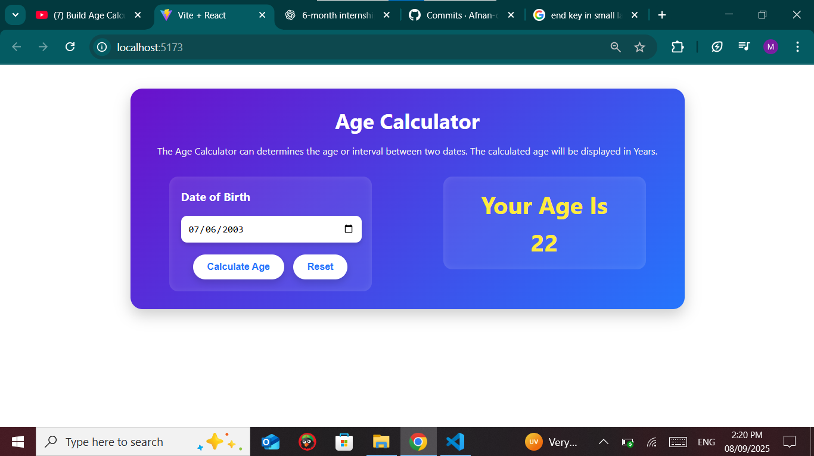

# 🎉 Age Calculator App  

A simple and interactive Age Calculator built with **React.js**.  
This app calculates the exact age based on the selected date of birth.  

---

## 🚀 Features  
- Select your **date of birth**  
- Calculates age accurately in **years**  
- **Reset** option to clear input and result  
- Clean and modern **UI with CSS**  
- Built with **React Hooks (useState)**  

---

## 🛠️ Tech Stack  
- **React.js**  
- **CSS3**  
- **JavaScript (ES6+)**  

---

## 📸 Screenshots  
  

---


## ⚡ Installation & Setup  
Follow these steps to run the project locally:  

```bash
# Clone the repository
git clone https://github.com/Afnan-coder/react-age-calculator.git

# Navigate to the project folder
cd react-age-calculator

# Install dependencies
npm install

# Start the development server
npm run dev

